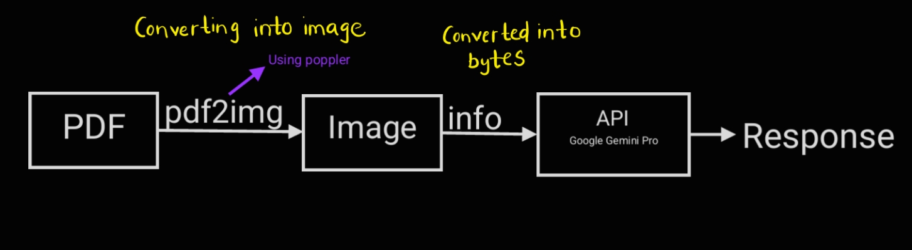
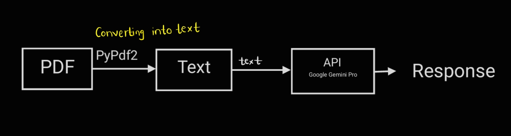

### **📌 Smart-ATS-Resume-Analyzer-using-Google-Gemini-Pro-Vision-LIM-Model**  
Resume ATS Analyzer evaluates resumes against job descriptions using AI, identifying key skills, missing keywords, and JD match percentage. Built with Flask, OpenAI/Gemini API, it provides ATS-friendly insights to optimize resumes for better job compatibility. 🚀

## **🚀 Features**  
✅ Compares resume content with job descriptions  
✅ Extracts missing keywords to improve ATS ranking  
✅ Generates match score percentage  
✅ Provides suggestions for resume optimization  

## **🛠️ Tech Stack**  
- **Python** (NLP & data processing)  
- **Streamlit** (Web UI)  
- **PyPDF2** / **pdf2image** (PDF text & image extraction)
- **Google Gemini AI API** (LLM for resume analysis)
- **AWS Lambda + API Gateway** (Optional: Deploy as a serverless API)  

## **⚙️ Installation & Usage**  

### **1️⃣ Clone the Repository**  
```bash
git clone https://github.com/yourusername/resume-ats-scanner.git
cd resume-ats-scanner
```

### **2️⃣ Install Dependencies**  
```bash
pip install -r requirements.txt
```

### **3️⃣ Run the Application**  
```bash
streamlit run app.py
```

### 🔗 Deploy to AWS (Optional)
You can deploy this project to AWS Lambda + API Gateway for cloud-based resume parsing. See this guide for steps.
Steps for AWS Deployment:
1. Install AWS CLI & configure credentials:
```bash
aws configure
```
2. Package the application using serverless framework:
```bash
npm install -g serverless
serverless deploy
```
3. Your API will be deployed on AWS and can be accessed via API Gateway.

## **🔀 Flow of the Analyzer**
1. Image->Bytes


2. Pdf->Text


## **📸 Screenshots**


## **📜 License**
MIT License - Feel free to use and contribute!

